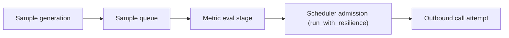

# Resilience Module Notes

This package provides the evaluator's process-local resilience control plane.

## Scope

- Session-scoped scheduler: each job/request uses its own scheduler instance.
- "Global" limits are global within a session, not process-wide across all jobs.
- Process-wide coordination is out of scope for V2.
- Inference, remote metric calls, and benchmark task calls use the same resilience API.

## Core APIs

- `run_with_resilience(endpoint_key, operation, *, max_attempts, deadline_at=None)`
  - Scheduler-owned admission + retries for one outbound operation.
- `use_resilience_session(global_limit=None, endpoint_max_limit=None)`
  - Context-scoped scheduler for one job/request.
  - If limits are omitted, defaults come from resilience config.
  - This does not automatically inherit evaluator `parallelism`.
- `run_indexed_tasks(indices, worker, *, parallelism)`
  - Bounded row/task fanout helper used by evaluator task paths.

## Concurrency Model

There are two concurrency layers by design:

1. Task-layer bounded dispatch (`run_indexed_tasks(..., parallelism=N)`):
   - Limits how many row-level coroutines are active.
   - Bounds task memory/CPU overhead and keeps job execution predictable.
2. Scheduler-layer adaptive admission (`run_with_resilience(...)`):
   - Enforces global+endpoint limits for outbound attempts.
   - Applies adaptive load-shedding, retry timing, and queue controls.

Because of scheduler admission, actual outbound call concurrency can be below
the task-layer parallelism cap under overload.

`parallelism` remains a task-layer control (how many row workers run).
Resilience limits are a separate control plane (session defaults or explicit
overrides via `use_resilience_session(...)`).

## Task Meaning and Dataflow

In this module, a scheduler "Task" means one outbound operation attempt
(for example an inference/remote call attempt), not a worker thread/process.
Retries are additional attempts of the same logical operation.

CPU-only metric work does not enter scheduler admission.

### Benchmark Job (CPU-only metrics)

### Metric Job (CPU-only metric)

### Benchmark Job (inference-backed metric)

### Metric Job (inference-backed metric)

## Failure Classification

Classification is centralized and static:

- Hard overload: `429`, `503`, explicit rate-limit exceptions.
- Soft overload: read/write/pool timeouts (and API timeout errors).
- Transient: connect timeouts, network errors, `500/502/504`.
- Fatal: non-retryable errors.

This classification drives both retry behavior and endpoint limit adaptation.

## Adaptation and Retry Algorithms

Endpoint limit adaptation (AIMD-style):

- Success path: fast-start doubles endpoint limit each `success_window` until the
  first failure for that endpoint, then switches to additive increase by `+1`.
- Hard overload: multiplicative decrease with `beta_hard_overload` + hard cooldown.
- Soft overload: multiplicative decrease with `beta_soft_overload` + soft cooldown.
- Repeated soft overloads in `escalation_window_seconds` escalate to hard behavior.

Retry wait computation:

- Base backoff: exponential with cap.
- Jitter: full jitter (`uniform(0, exp)`).
- Floors: max of `Retry-After`, cooldown remaining, and computed jitter.
- Pressure multiplier inflates waits as endpoint pressure increases.

## Example Flow

Example online job with `parallelism=8`:

1. Task layer starts up to 8 row workers.
2. Each outbound attempt goes through `run_with_resilience(...)`.
3. If endpoint starts timing out:
   - classify as soft overload,
   - reduce endpoint limit,
   - apply cooldown floor,
   - retries wait longer under increased pressure.
4. On sustained success after cooldown, endpoint limit gradually ramps up again.

Interpretation:
- You can think of `parallelism` as an upper bound on work generation.
- You can think of resilience limits as an upper bound on outbound I/O admission.
- Effective outbound concurrency is the minimum of what workers are trying to do
  and what the scheduler admits at that moment.

## Why Keep Outer Parallelism If Scheduler Also Limits?

Using only scheduler limits is possible, but the current approach is a practical
tradeoff:

- Pros:
  - Simpler per-job resource bounds at task level.
  - Job parallelism no longer forces scheduler global/endpoint caps.
- Cons:
  - Not a single pure scheduler-driven launch model.

If future profiling shows benefit, we can add an internal task fanout factor
(for example `task_concurrency = 2 * parallelism`) to better overlap CPU-bound
pre/post work while keeping scheduler I/O pressure caps unchanged.
