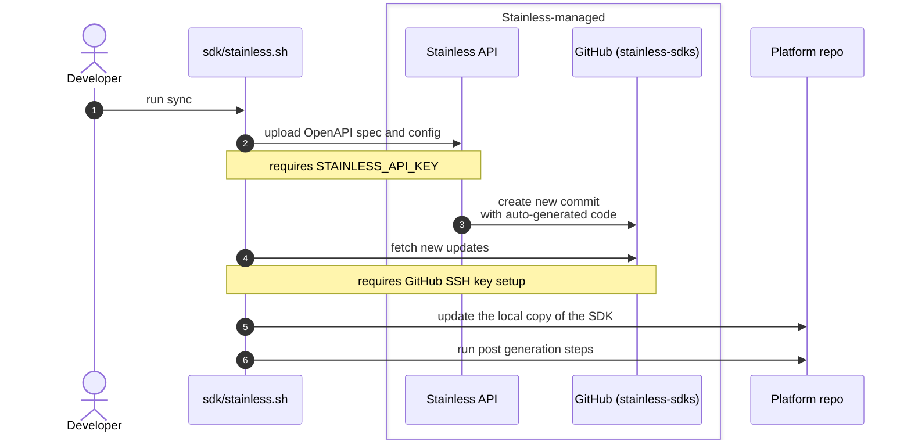

# Stainless API Setup Instructions

To use Stainless for SDK generation, there is one-time setup required.

For the context, here's the sequence diagram of the SDK generation process:



## 1. Create a Stainless account

**Why?** We use Stainless to generate the SDK code and the code generation happens in their cloud.

Request an invitation.
- The invitation will be sent to your NVIDIA email address.
- Follow the link in the email to create your account.
- Creating the Stainless account requires GitHub account. You can use an existing account or create a new one.

## 2. Get access to GitHub repositories

**Why?** Stainless uses GitHub repositories to store the generated SDK code and configuration files. These repositories live in the `stainless-sdks` organization, so to be able to access them, you'll need to accept an invite in GitHub.

The easiest way to do that is to open this link in your browser:
- https://github.com/stainless-sdks/nemo-platform-python: generated Python code.

<details>
<summary>CLI command to do the same</summary>

```shell
open https://github.com/stainless-sdks/nemo-platform-python
```
</details>

The above links MUST work with your GitHub account that you used when setting up your Stainless account!

If either repo above 404s, this indicates the recurrence of a bug with stainless auto invites.
Check your email for an invite to the affected repo, and if you do not have an invite, create a thread in `#swdl-aire-collab` and tag `@nmp-sdk-support`. We will need to rerequest the invite link for your GitHub account with the Stainless team (there's an external, private slack channel for this).

Note you will receive GitHub invites to ~15 repos in your email after accepting the invite in step 1, recommended to accept all the invites so you have access to the repos. Though at this time only the `nemo-platform-v1-python` repo is required for the Python SDK generation.

## 3. Create a Stainless API key

**Why?** The API key is used to authenticate with the Stainless API to trigger the SDK generation process.

Go to Stainless Webapp (https://app.stainless.com/nvidia/settings) and create an API key.
Copy the key and set it in your environment as `STAINLESS_API_KEY`.

## 4. Setup GitHub SSH keys

**Why?** To pull the generated code from the GitHub repository, you need to set up SSH keys for your GitHub account.

Follow the instructions in the [GitHub documentation](https://docs.github.com/en/authentication/connecting-to-github-with-ssh/adding-a-new-ssh-key-to-your-github-account) to add SSH keys to your GitHub account.

TL;DR:
```shell
pbcopy < ~/.ssh/id_ed25519.pub
open https://github.com/settings/keys
# paste the key
```
