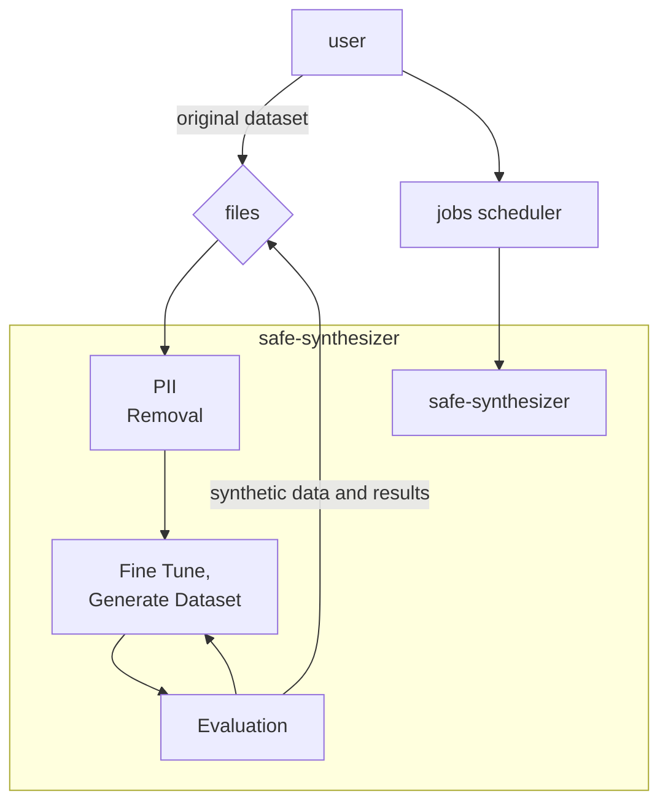

# Safe Synthesizer Service (not S3 🤔)

This is the service that enables running Safe Synthesizer jobs via an API. It imports types and
utilities from the `nemo-safe-synthesizer` package (external dependency). 

## Quick Reference

Run `make help` to see all available commands:

```bash
make help
```

## Local NSS Development

The service depends on `nemo-safe-synthesizer`, which is resolved through the
project's configured package indexes by default. This is the standard
configuration for CI and production.

When iterating on changes to the `nemo-safe-synthesizer` package locally, you
can temporarily switch to a locally-built wheel.

### Prerequisites

You need a local clone of the [Safe-Synthesizer](https://github.com/NVIDIA/nemo-safe-synthesizer) repository. By default, the Makefile expects it at `../../Safe-Synthesizer` (sibling to the Platform repo root). Override this with `NSS_REPO_PATH`:

```bash
export NSS_REPO_PATH=/path/to/Safe-Synthesizer
```

### Switch to a local NSS build

```bash
make use-nss-local
```

This will:
- Check out and pull the latest from `NSS_REPO_REF` (defaults to `main`)
- Build a wheel from the NSS repo
- Copy the wheel to `packages/nemo_safe_synthesizer_wheel/`
- Patch `pyproject.toml` to point at the local wheel
- Re-lock dependencies

To build from a specific branch or tag:

```bash
NSS_REPO_REF=my-feature-branch make use-nss-local
```

Before committing, restore any local wheel changes in `pyproject.toml` and
`services/safe-synthesizer/pyproject.toml`, then rerun `uv lock`.

## Docker Development

For containerized development, use the two-stage build process:

### 1. Build the base image (one-time or when dependencies change)

```bash
make build-initial-image
```

This builds the full image with all dependencies installed. Run this:
- Once when you first start developing
- When `pyproject.toml` or other dependencies change
- When the base Dockerfile changes

The image is tagged as `my-registry/safe-synthesizer:initial`.

### 2. Build the dev image (for code changes)

```bash
make build-dev-image
```

This builds a lightweight image on top of the base, copying only your code changes. Much faster than a full rebuild since dependencies are already installed.

The image is tagged as `my-registry/safe-synthesizer:local`.

### Start the Platform (Recommended)

The easiest way to run the safe-synthesizer service locally is via the quickstart command, which starts the NeMo Platform with all required services:

```bash
make quickstart-up
```

This starts:
- The safe-synthesizer service
- Supporting services: entities, jobs, secrets, files, auth
- Controllers: jobs, models

The platform runs on `http://0.0.0.0:8080` with hot-reload enabled.

## Running E2E Tests

First, start the platform:

```bash
make quickstart-up
```

Then in another terminal, run one of the E2E tests:

```bash
# PII removal only (faster)
make run-e2e-test-pii-only

# Full test with PII removal and synthetic data generation
make run-e2e-test
```


